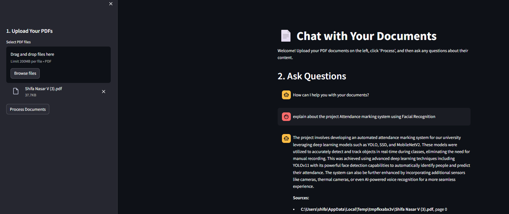

# Chat with Your PDFs – Local RAG Chatbot

This project is a **Streamlit-based chatbot interface** that allows users to interact with their PDF documents conversationally. Upload one or more PDFs and ask questions — the application retrieves relevant content and generates answers using a local LLM via Ollama, ensuring complete data privacy.

---

## ✨ Features

### 📂 Upload Multiple PDFs

* Upload and process multiple PDF documents simultaneously
* Extracts and indexes content from all uploaded files

### 💬 Interactive Chat Interface

* Ask questions about uploaded documents
* Conversational Q&A experience using RAG pipeline

### 📚 Source Citing

* Responses include:

  * Source document name
  * Page number
* Improves trust and traceability of answers

### 🔒 Local & Private

* Uses **local LLM via Ollama**
* No document data sent to external APIs
* Fully offline and privacy-safe

### 🔗 Built with LangChain

* Implements Retrieval-Augmented Generation (RAG)
* Efficient document retrieval and contextual responses

---

## ⚙️ How It Works

The application follows a **Retrieval-Augmented Generation (RAG)** architecture.

### 1️⃣ Document Loading

* Upload PDF files
* Extract text content from documents

### 2️⃣ Text Splitting

* Splits extracted text into smaller chunks
* Prepares data for embedding and retrieval

### 3️⃣ Embedding & Vector Storage

* Converts text chunks into embeddings using Hugging Face models
* Stores embeddings in **ChromaDB vector database**
* Enables fast semantic search

### 4️⃣ Retrieval & QA Chain

When a user asks a question:

1. The question is converted into embeddings
2. Vector database retrieves relevant document chunks
3. Retrieved context + question sent to local LLM (e.g., tinydolphin)
4. LLM generates final answer with sources

---

## 🛠️ Tech Stack

**Frontend:**

* Streamlit

**LLM Orchestration:**

* LangChain

**Local LLM Provider:**

* Ollama

**Vector Database:**

* ChromaDB

**Embeddings:**

* Hugging Face sentence-transformers

**PDF Processing:**

* PyPDF

---

## 🚀 Setup and Installation

Follow these steps to run locally.

### 1️⃣ Prerequisites

Ensure you have:

* Python 3.8+
* Ollama installed and running

  * Download from: https://ollama.com

---

### 2️⃣ Install Python Dependencies

Install required libraries:

```bash
pip install streamlit langchain langchain-community pypdf chromadb sentence-transformers
```

---

### 3️⃣ Pull the Ollama Model

The app uses **tinydolphin** model by default.

Run:

```bash
ollama pull tinydolphin
```

#### Using another model

You can change the model in `app.py`:

```
LLM_MODEL = "your_model_name"
```

Then pull that model:

```bash
ollama pull your_model_name
```

---

### 4️⃣ Run the Streamlit App

Start the application:

```bash
streamlit run app.py
```

Your browser will open the chatbot interface automatically.

---

## 🖥️ Chatbot Interface



---

## 📌 Use Cases

* Chat with research papers
* Document analysis assistant
* Legal/financial document Q&A
* Personal knowledge base
* Offline private AI assistant
* RAG architecture learning project
